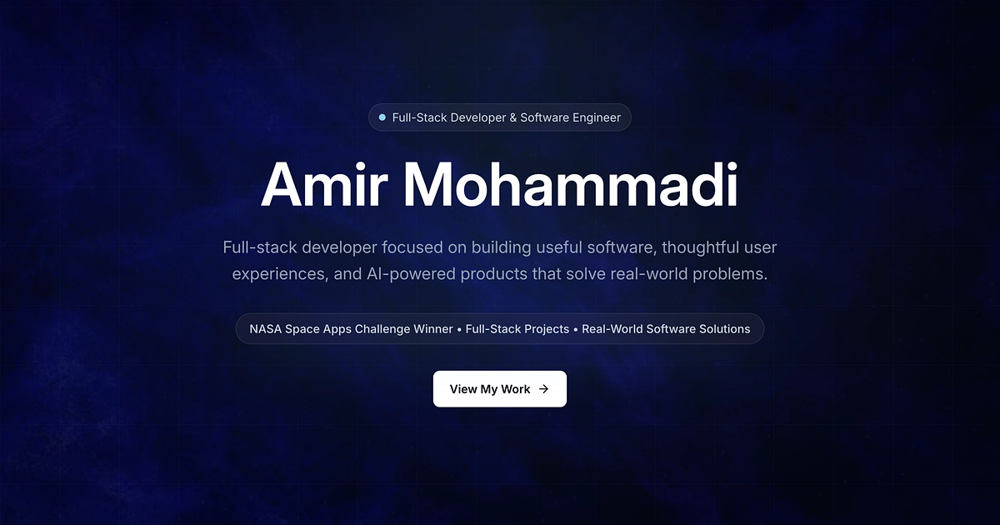

# Amir Mohammadi | Developer Portfolio

A responsive developer portfolio showcasing Amir Mohammadi's software projects, technical experience, and journey as a recent Software Engineering Technician graduate. The portfolio is focused on junior software developer, React developer, full-stack developer, and entry-level AI-related opportunities.

**Live Site:** Coming soon



## Overview

This portfolio presents selected work through detailed project case studies, including each project's problem, solution, features, technical challenges, and lessons learned. It also provides a downloadable resume, professional profile, skills overview, development journey, and a contact form.

## Tech Stack

- **Frontend:** React 19, TypeScript, Vite
- **Styling:** Tailwind CSS v4
- **Animation:** Framer Motion
- **Routing:** React Router DOM
- **Icons:** Lucide React
- **Utilities:** clsx, tailwind-merge
- **Forms:** React Hook Form, Zod, Formspree
- **Deployment:** Vercel

## Key Features

- Responsive layouts designed for desktop, tablet, and mobile
- Individual project case studies with screenshots and technical details
- Animated page transitions and interface elements with reduced-motion support
- SEO, Open Graph, and Twitter card metadata
- Downloadable resume integration
- Formspree-powered contact form with client-side validation and status feedback
- Accessible navigation and dedicated project routes
- Custom favicon and social sharing preview assets

## Featured Projects

### FreshTrace

An AI-powered, full-stack grocery management platform that scans receipts with OCR, tracks food freshness, and generates recipe suggestions.

- **Role:** Full-Stack Developer / Team Member
- **Stack:** React, TypeScript, Prisma, PostgreSQL, Supabase, OCR, REST APIs
- **Live:** [freshtrace.app](https://freshtrace.app/)
- **Source:** [GitHub](https://github.com/T5-W26-COMP231/freshtrace)

### Cafe195

A full-stack coffee shop ordering platform with authentication, product management, order handling, and role-based dashboards.

- **Role:** Full-Stack Developer
- **Stack:** React, Node.js, Express, MongoDB, REST APIs, JWT
- **Live:** [Cafe195](https://cafe-195-frontend.onrender.com/)
- **Source:** [GitHub](https://github.com/ameeshajaswal/Cafe-195)

### Asteroid Zero

An award-winning hackathon project that uses NASA data to visualize asteroid information and space-related risks.

- **Role:** Frontend Developer / Team Member
- **Stack:** HTML, CSS, JavaScript, NASA APIs, REST APIs, JSON
- **Awards:** Most Creative Project; Best Use of Data Sources
- **Live:** [Asteroid Zero](https://asteroidzero.netlify.app/)

## Local Setup

### Prerequisites

- Node.js
- npm

### Installation

1. Clone the repository:

   ```bash
   git clone https://github.com/LoyaltyAriyo/portfolio.git
   cd portfolio
   ```

2. Install dependencies:

   ```bash
   npm install
   ```

3. Create a `.env.local` file for the contact form:

   ```env
   VITE_FORMSPREE_ENDPOINT=your_formspree_endpoint
   ```

4. Start the development server:

   ```bash
   npm run dev
   ```

5. Open the local URL shown by Vite in your browser.

The site can run without a Formspree endpoint, but contact form submissions will not succeed until `VITE_FORMSPREE_ENDPOINT` is configured.

## Available Scripts

| Command | Description |
| --- | --- |
| `npm run dev` | Starts the Vite development server. |
| `npm run build` | Type-checks the project and creates a production build. |
| `npm run lint` | Runs ESLint across the project. |
| `npm run preview` | Serves the production build locally for review. |

## Deployment

The portfolio is designed for deployment on Vercel.

1. Import the GitHub repository into Vercel.
2. Use the default Vite build settings:
   - Build command: `npm run build`
   - Output directory: `dist`
3. Add `VITE_FORMSPREE_ENDPOINT` in the Vercel project environment variables.
4. Deploy the project.

Because the application uses client-side routing, Vercel may require a rewrite to `index.html` if direct navigation to project detail routes returns a 404.

## Contact

- **Email:** [amirhossein1384m@gmail.com](mailto:amirhossein1384m@gmail.com)
- **LinkedIn:** [linkedin.com/in/amirhossein1384m](https://www.linkedin.com/in/amirhossein1384m/)
- **GitHub:** [github.com/LoyaltyAriyo](https://github.com/LoyaltyAriyo)

## License

This portfolio and its source code are maintained by Amir Mohammadi. No license has been specified.
